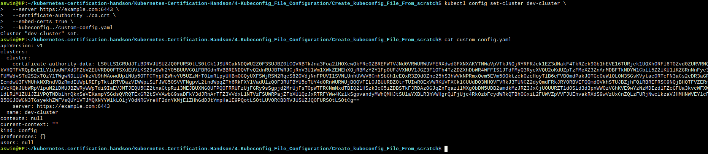
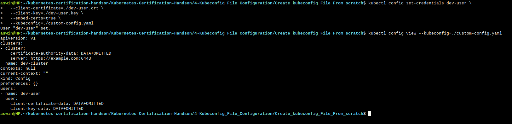
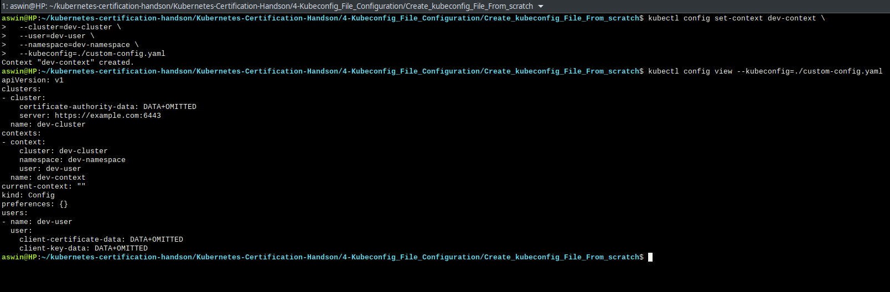

## Create a Custom Kubeconfig File from Scratch using Kubectl commands

We’ll create a kubeconfig in the current directory

```go
./custom-config.yaml
```

## STEP 1: Set the cluster in a custom file

#First step is to add the cluster details such as the name, IP address, certificates etc.

```go
kubectl config set-cluster dev-cluster \
  --server=https://example.com:6443 \
  --certificate-authority=./ca.crt \  #Path of crt file ca.crt ( ca.crt file is the public certificate of the Kubernetes cluster’s Certificate Authority (CA). It usually reside at: /etc/kubernetes/pki/ca.crt)
  --embed-certs=true \  #It embeds the contents of the certificate file directly into the kubeconfig file, instead of just referencing the path to the certificate file.
  --kubeconfig=./custom-config.yaml
```




##  STEP 2: Set the user in the same custom file

```go
kubectl config set-credentials dev-user \
  --client-certificate=./dev-user.crt \
  --client-key=./dev-user.key \
  --embed-certs=true \
  --kubeconfig=/custom-config.yaml
```


## STEP 3: Set the context in the custom file

```go
kubectl config set-context dev-context \
  --cluster=dev-cluster \
  --user=dev-user \
  --namespace=dev-namespace \
  --kubeconfig=./custom-config.yaml
```


## STEP 4: Set the current context in the custom file

```go
kubectl config use-context dev-context \
  --kubeconfig=./custom-config.yaml
```

Check current context


```go
kubectl config current-context --kubeconfig=./custom-config.yaml
```

## Using the custom kubeconfig

```go
kubectl get pods --kubeconfig=./custom-config.yaml
```

Or export it as the default for your shell session:

```go
export KUBECONFIG=./custom-config.yaml
```
