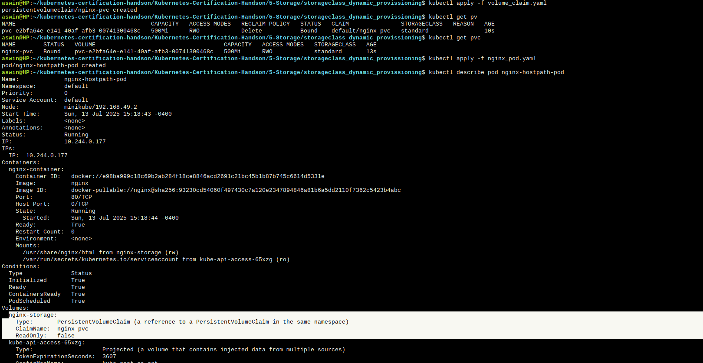

## Storage class allows ro dynamically provission volume with out manually creating the PV

Image shows that a PV is automatically created by standard storage class with exact 500Mi of storage as defined in PVC
This volume is then mounted to the Pod by refering the PVC